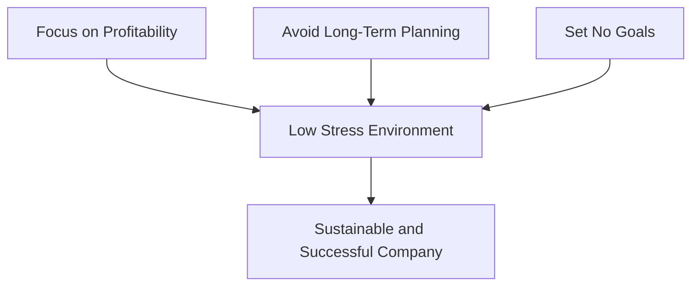

import { Callout, Steps, Step } from "nextra-theme-docs";

# Building a Low-Stress, Profitable Company

In this section, we'll explore Jason Fried's approach to building and maintaining a profitable, low-stress company. As the co-founder and CEO of 37 Signals, Jason has successfully led his company for over 25 years, prioritizing sustainability and employee well-being while achieving consistent profitability.

Jason's philosophy revolves around three key principles:

1. [Focusing on Profitability](/building-a-profitable-company/focusing-on-profitability)
2. [Avoiding Long-Term Planning](/building-a-profitable-company/avoiding-long-term-planning)
3. [Setting No Goals](/building-a-profitable-company/setting-no-goals)

By adhering to these principles, 37 Signals has managed to create a work environment that is both financially successful and emotionally rewarding for its employees.

<Callout>
Jason emphasizes the importance of maintaining high margins and keeping costs low. This approach allows the company to remain agile and adaptable, without the pressure of meeting aggressive growth targets or satisfying external investors.
</Callout>

One of the key factors contributing to 37 Signals' success is their focus on creating products that solve real problems for their customers. By prioritizing user needs and iterating based on feedback, the company has built a loyal customer base that appreciates the value their products provide.

Jason also stresses the importance of maintaining a small, talented team. By keeping the company lean, 37 Signals can ensure that every employee is engaged, motivated, and contributing meaningfully to the company's success. This approach not only helps to keep costs down but also fosters a sense of ownership and accountability among team members.

By prioritizing profitability, avoiding long-term planning, and setting no goals, 37 Signals has created a low-stress environment that ultimately leads to a sustainable and successful company.

In the following subsections, we'll dive deeper into each of these principles and explore how they contribute to building a low-stress, profitable company:

- [Focusing on Profitability](/building-a-profitable-company/focusing-on-profitability)
- [Avoiding Long-Term Planning](/building-a-profitable-company/avoiding-long-term-planning)
- [Setting No Goals](/building-a-profitable-company/setting-no-goals)

By understanding and applying these principles, you can create a company culture that prioritizes employee well-being and financial stability, setting the foundation for long-term success.