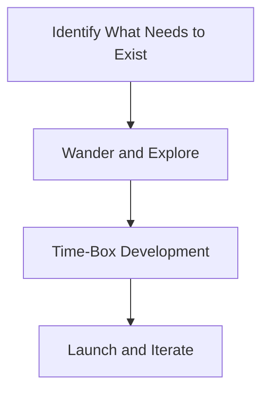

import { Callout, Steps, Step } from "nextra-theme-docs";

# Product Development Process

Jason Fried and his team at 37 Signals have a unique approach to creating and launching new products. Their process is designed to foster creativity, maintain focus, and ensure that the products they develop are truly needed by their target audience.

The product development process at 37 Signals can be broken down into three main stages:

1. [Identifying What Needs to Exist](/product-development-process/identifying-what-needs-to-exist)
2. [The Importance of Wandering](/product-development-process/importance-of-wandering)
3. [Time-Boxing Development](/product-development-process/time-boxing-development)

<Callout>
Jason Fried emphasizes the importance of having a strong point of view when developing products. This perspective helps guide the entire process and ensures that the final product is unique and valuable to users.
</Callout>

Throughout the product development process, Jason and his team focus on simplicity and elegance. They strive to create products that are intuitive and easy to use, while still providing powerful functionality.

One of the key aspects of 37 Signals' product development process is their willingness to iterate and adapt. They don't get too attached to their initial ideas and are always open to making changes based on user feedback and new insights.

By following this process, 37 Signals has consistently delivered successful products that have garnered a loyal following. Their approach to product development is a testament to the power of focusing on user needs, maintaining flexibility, and staying true to your vision.