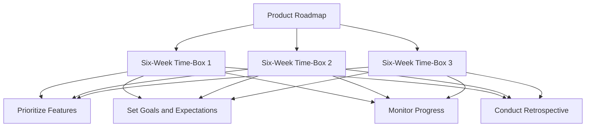

import { Callout, Steps, Step } from "nextra-theme-docs";

# Time-Boxing Development

When it comes to product development, 37 Signals takes a unique approach by breaking the process into manageable six-week chunks. This practice, known as time-boxing, helps maintain focus and momentum throughout the development cycle.

<Callout type="info">
Time-boxing is a project management technique that allocates a fixed period of time to each planned activity or phase of a project. This approach helps to prevent scope creep and ensures that projects are completed on time.
</Callout>

## Benefits of Time-Boxing

- **Increased focus**: By working in six-week increments, the team can concentrate on specific features or improvements without getting bogged down by the entire project scope.
- **Improved accountability**: Time-boxing creates a sense of urgency and encourages team members to be more accountable for their work.
- **Better prioritization**: With limited time available, the team must prioritize tasks and features based on their importance and feasibility.
- **Regular progress**: Six-week cycles ensure that the product is continuously evolving and improving, with tangible results at the end of each time-box.

## Implementing Time-Boxing in Your Product Development Process

<Steps>

### Step 1: Break down the product roadmap

Divide your product roadmap into smaller, manageable chunks that can be completed within a six-week time frame. Prioritize features and improvements based on their importance and feasibility.

### Step 2: Set clear goals and expectations

At the beginning of each six-week cycle, clearly define the goals and expectations for the team. Ensure that everyone understands what needs to be accomplished and how their work contributes to the overall product vision.

### Step 3: Monitor progress and adjust as needed

Throughout the six-week cycle, regularly monitor progress and make adjustments as necessary. If a task or feature proves to be more complex than initially anticipated, prioritize it for the next time-box or consider simplifying it to fit within the current cycle.

### Step 4: Conduct a retrospective

At the end of each six-week cycle, conduct a retrospective to evaluate the team's performance, identify areas for improvement, and celebrate successes. Use the insights gained from the retrospective to inform the planning and prioritization of the next time-box.

</Steps>

By adopting a time-boxing approach to product development, you can create a more focused, efficient, and results-driven process. This method ensures that your product is continuously evolving and improving while maintaining a healthy balance between [exploration and commitment](/product-development-process/importance-of-wandering).

The time-boxing process can be visualized as a series of six-week cycles, each consisting of prioritizing features, setting goals and expectations, monitoring progress, and conducting a retrospective. This iterative approach ensures that the product development process remains focused and adaptable, allowing for continuous improvement and refinement.